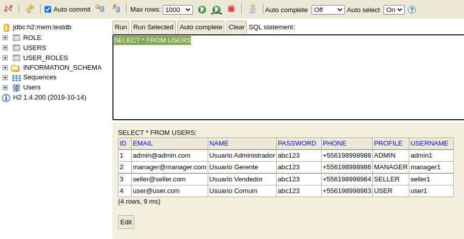
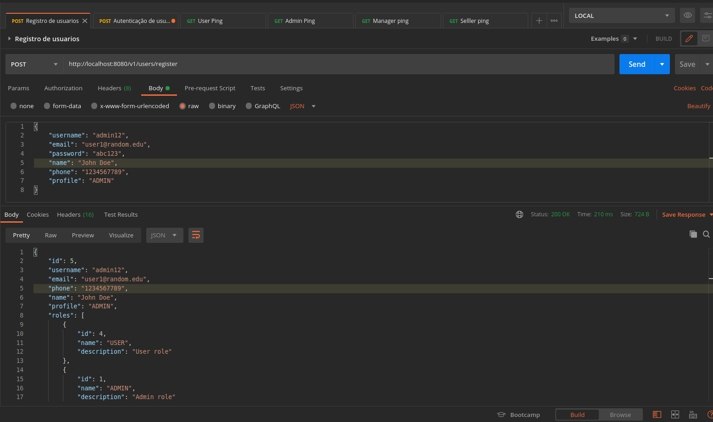

# Template projeto NÃO-FUNCIONAL

Api de modelo com acesso ao banco / geração e validação de token / vault

Framework Spring Boot contendo:

	- Spring Cloud
	- Spring Security
	- Spring JPA
	- Spring Swagger 2
	- H2 Database
	- Json JWT
	- Lombok (1.18.22)

Acesso para o Swagger: **http://localhost:8080/swagger-ui.html**

---	
### Dados carregados na inicialização

Para adiantar o desenvolvimento e teste, foi adicionado um arquivo [/src/main/resources/data-h2.sql] que já adiciona 4 tipos de usuários:

1. ADMIN (Administrador)
2. MANAGER (Gerente)
3. SELLER (Vendedor)
4. USER (Usuario Comum)

A Hieraquia de acesso segue na ordem acima.

Acesso para H2 Database: **http://localhost:8080/console** (usuario: sa /senha: password)

---	

Postman Collection adicionado com os endPoint's disponíveis.

<a href="SpringSecurity.postman_collection.json" download>Clique aqui para Download</a>

